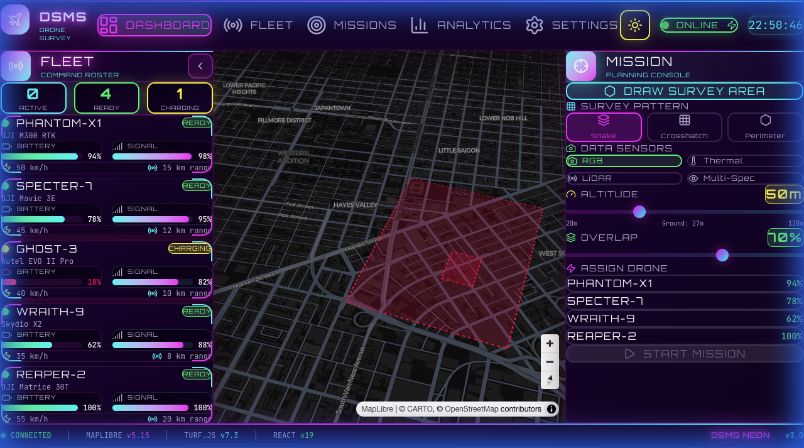
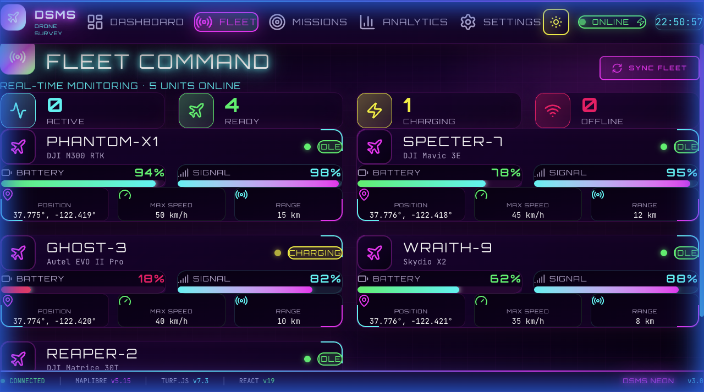
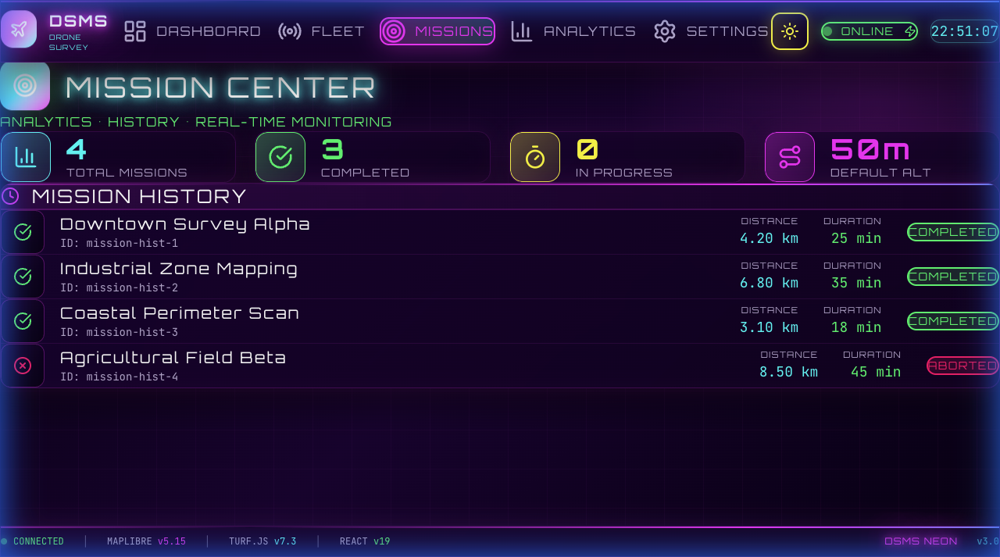
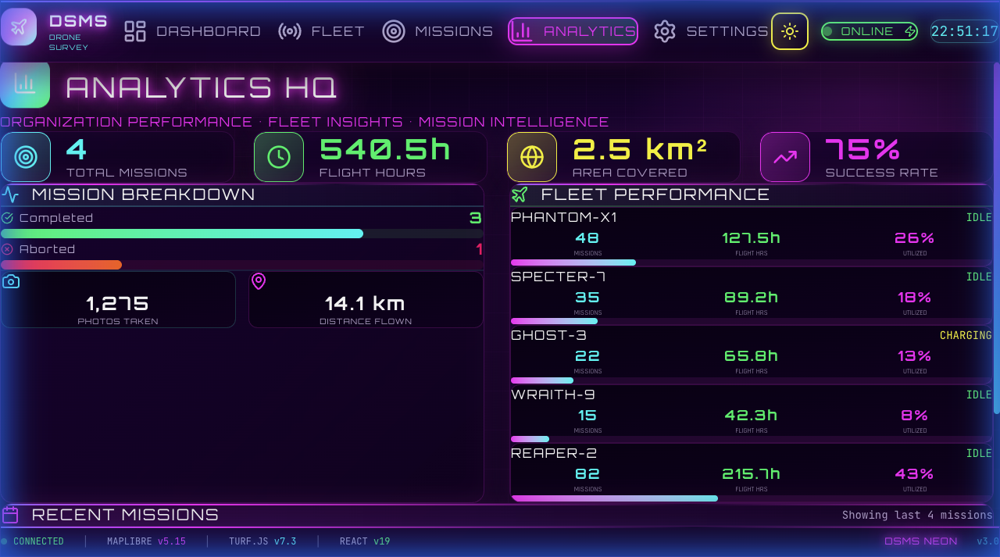

<p align="center">
  
  
  
  
  
  
</p>

<h1 align="center">🚁 DSMS – Drone Survey Management System</h1>

<p align="center">
  <strong>A futuristic Command Center for drone mission planning</strong><br>
  <em>Built with a Cyberpunk HUD aesthetic • Advanced Mission Planning • Real-time Monitoring</em>
</p>

---

## 📸 Screenshots

````carousel

<!-- slide -->

<!-- slide -->

<!-- slide -->

````

## 📖 Table of Contents

- [About](#-about)
- [Features](#-features)
- [Pages](#-pages)
- [Tech Stack](#-tech-stack)
- [Getting Started](#-getting-started)
- [Getting Started](#-getting-started)
- [Technical Documentation](docs/TECHNICAL_DOCS.md)
- [Detailed Working Guide](#-detailed-working-guide)
  - [Mission Planning](#mission-planning-workflow)
  - [Fleet Management](#fleet-management-workflow)
  - [Analytics](#analytics-workflow)
- [Algorithms](#-algorithms)
- [Configuration](#-configuration)
- [License](#-license)

---

## 🎯 About

**DSMS (Drone Survey Management System)** is a comprehensive platform for managing drone operations. It combines advanced path planning algorithms with a visually stunning Neon Cyberpunk interface to provide operators with a futuristic command center experience.

The system allows for precise survey plotting on a 3D globe, optimizing flight paths with selectable patterns (Snake, Crosshatch, Perimeter), and simulating missions with realistic physics before deployment.

---

## ✨ Features

### 🌐 Advanced Mission Planning
- **3 Survey Patterns**:
  - **Snake (Lawnmower)**: Standard efficient area coverage.
  - **Crosshatch**: Double-pass grid for high-detail 3D reconstruction.
  - **Perimeter**: Boundary-only surveillance flights.
- **Sensor Config**: Multi-select RGB, Thermal, LiDAR, and Multispectral sensors.
- **Intelligent Pathing**: "Principal Axis" algorithm aligns flight lines with the longest edge to minimize turns.
- **Safety Checks**: Automatic validation against battery levels and range.

### 🚁 Fleet & Live Monitoring
- **Real-time Telemetry**: Live updates of battery, speed, signal, and GPS position.
- **Mission Progress**: HUD overlay showing improved flight metrics, ETA, and waypoints.
- **Control Center**: Pause, Resume, Abort, RTH (Return to Home), and Speed Control (1x-10x).

### 📊 Analytics & Reporting
- **Organization Stats**: Total flight hours, area covered (km²), and mission success rates.
- **Fleet Insights**: Per-drone utilization metrics and health status.
- **Mission History**: Detailed logs of past operations with coverage heatmaps.

---

## 📄 Pages

| Route | Page | Description |
|-------|------|-------------|
| `/` | **Dashboard** | The Command Center. Draw polygons, configure flight parameters, generate paths, and control the live simulation. |
| `/fleet` | **Fleet** | Organization-wide drone inventory. Monitor status (Flying, Idle, Charging), battery health, and signal strength. |
| `/missions` | **Missions** | Historical archive of all operations. View logs, success rates, and detailed metrics for past flights. |
| `/analytics` | **Analytics** | High-level organization intelligence. Visual charts and KPIs for productivity and efficiency. |
| `/settings` | **Settings** | System preferences. Configure map units, default mission parameters, and application alerts. |

---

## 🛠️ Tech Stack

- **Frontend**: React 19, TypeScript, Vite
- **Sytling**: Tailwind CSS v4, Custom CSS Animations
- **Maps**: MapLibre GL JS, Turf.js
- **State Management**: Zustand
- **Icons**: Lucide React
- **Data Persistence**: Supabase (Optional)

---

## 🚀 Getting Started

### Prerequisites
- Node.js 18+
- npm 9+

### Installation & Running

```bash
# 1. Clone the repository
git clone https://github.com/aman99dex/dsms-cyberpunk.git
cd dsms-cyberpunk

# 2. Install dependencies
npm install

# 3. Start the development server
npm run dev
# The app will open at http://localhost:5173
```

---

## 📘 Detailed Working Guide

### Mission Planning Workflow
1.  **Draw Area**: On the Dashboard, click **"Draw Survey Area"**. Click point-by-point on the globe to define your survey polygon. Double-click to close it.
2.  **Configure Parameters**:
    -   **Pattern**: Select how the drone covers the area (Snake for efficiency, Crosshatch for 3D models).
    -   **Altitude**: Slider controls flight height (20m - 120m). Lower altitude = higher resolution but longer flight time.
    -   **Overlap**: Adjust photo overlap (30% - 90%). Higher overlap improves stitching quality.
    -   **Sensors**: Toggle required payloads (RGB, Thermal, etc.).
3.  **Generate Path**: The system auto-calculates the optimal path. Click **"Regenerate"** if you change parameters.
4.  **Simulate**: Click **"Start Mission"** to visualize the flight. Use the HUD controls to change speed or abort.

### Fleet Management Workflow
1.  **Monitor Status**: Go to the **Fleet** page to see all 5 organization drones.
2.  **Check Readiness**: Ensure drones are marked **"IDLE"** and have **Battery > 20%** before assigning missions.
3.  **Live Tracking**: Drones currently on missions appear as **"FLYING"** with real-time telemetry updates.
4.  **Maintenance**: Drones with low battery will automatically switch to **"CHARGING"** status.

### Analytics Workflow
1.  **Performance Review**: Visit **Analytics** to see the big picture.
2.  **KPIs**: Track "Total Area Covered" and "Flight Hours" to measure team productivity.
3.  **Success Rate**: Monitor "Completed" vs "Aborted" missions to identify operational issues.
4.  **Success Rate**: Monitor "Completed" vs "Aborted" missions to identify operational issues.

---

##  Algorithms

**Path Generation Logic**:
1.  **Boundaries**: Calculates the bounding box of the user-drawn polygon.
2.  **Principal Axis**: Identifies the longest edge of the polygon to determine the most efficient flight direction.
3.  **Grid Lines**: Generates parallel scan lines based on calculated camera footprint (derived from altitude & FOV).
4.  **Intersection**: Clips scan lines to the polygon boundaries using ray-casting.
5.  **Connection**: Links lines in a serpentine (snake) pattern for continuous flight.
6.  **Optimization**: Adds entry/exit points for nearest-neighbor drone deployment.

---

<p align="center">
  <strong>Crafted with precision for the future of autonomy.</strong> ✈️ <br>
  Built by <a href="https://github.com/aman99dex">Aman</a>
</p>
